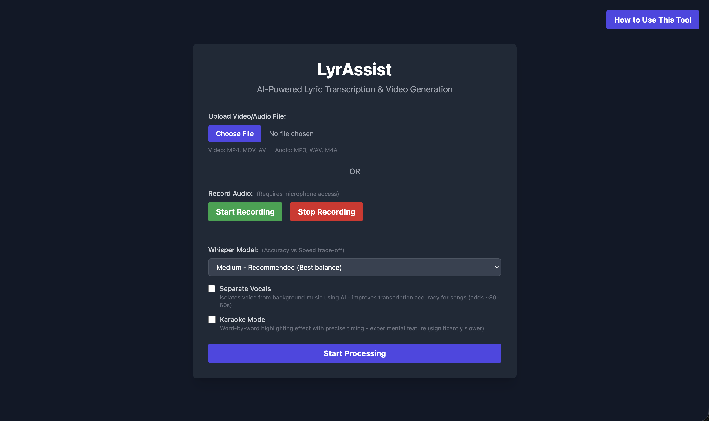

# LyrAssist

**AI-Powered Lyric Transcription & Video Generation**

LyrAssist is a full-stack web application that automatically transcribes audio/video files and generates synchronized lyric videos using state-of-the-art AI models. Upload a song or video, and get back a professionally formatted lyric video with interactive transcript features.



---

## Features

### 🎤 Smart Audio Processing
- **Multiple Input Methods**: Upload audio files (MP3, WAV, M4A), video files (MP4, MOV, AVI), or record directly in your browser
- **Vocal Separation**: Optional AI-powered vocal isolation using Demucs for improved transcription accuracy on music tracks
- **Flexible Model Selection**: Choose from 5 Whisper model sizes to balance speed and accuracy

### 🎬 Intelligent Video Generation
- **Audio-to-Video**: Automatically generates lyric videos with black backgrounds for audio-only files
- **Video Enhancement**: Overlays synchronized lyrics on existing video content
- **Two Rendering Modes**:
  - **Phrase Mode**: Clean, phrase-level subtitles with dynamic positioning
  - **Karaoke Mode**: Word-by-word highlighting with precise timestamps (experimental)

### 📝 Interactive Transcript Features
- **Clickable Lyrics**: Click any word or line in the transcript to jump directly to that moment in the video
- **Auto-Play**: Video automatically starts playing when you click on lyrics
- **Downloadable Transcript**: Export timestamped transcripts as formatted text files
- **Spotify-Style UI**: Clean, modern interface with hover effects and smooth interactions


### ⚡ Real-Time Processing
- **Live Logs**: Watch real-time processing updates as AI transcribes and renders your video
- **Background Processing**: Asynchronous task handling prevents browser timeouts
- **Progress Tracking**: Clear status updates throughout the entire pipeline


---

## Demo

### Upload & Configure


### Result View


### Download Options
- Download the generated video (MP4 format)
- Download the transcript (TXT with timestamps)
- Watch inline with interactive lyrics

---

## Technology Stack

### Backend
- **Python 3.10+** - Core application runtime
- **Flask** - Web framework for API and routing
- **OpenAI Whisper** - State-of-the-art speech-to-text transcription
- **WhisperX** - Forced alignment for word-level timestamps
- **Demucs** - Neural source separation for vocal isolation
- **MoviePy** - Video composition and subtitle rendering
- **PyTorch** - Deep learning backend

### Frontend
- **HTML5 + Tailwind CSS** - Responsive, modern UI
- **Vanilla JavaScript** - Client-side interactivity
- **MediaRecorder API** - Browser-based audio recording

### Media Processing
- **FFmpeg** - Video/audio encoding and processing
- **Pydub** - Audio manipulation and format conversion
- **h264_videotoolbox** - Hardware-accelerated video encoding (macOS)

---

## Installation

### Prerequisites

1. **Python 3.10 or higher**
2. **FFmpeg** - Required for media processing
   ```bash
   # macOS
   brew install ffmpeg

   # Ubuntu/Debian
   sudo apt update && sudo apt install ffmpeg

   # Windows
   # Download from https://ffmpeg.org/download.html
   ```

### Setup

1. **Clone the repository**
   ```bash
   git clone <your-repository-url>
   cd voiceAIcodebase
   ```

2. **Create a virtual environment**
   ```bash
   python -m venv venv

   # Activate on macOS/Linux
   source venv/bin/activate

   # Activate on Windows
   venv\Scripts\activate
   ```

3. **Install Python dependencies**
   ```bash
   pip install flask pydub openai-whisper moviepy numpy demucs torch torchaudio "numpy<2" --force-reinstall
   pip install git+https://github.com/m-bain/whisperX.git --upgrade
   ```

   > **Note**: NumPy is downgraded to <2.0 due to compatibility requirements with WhisperX dependencies.

4. **Create required directories**
   ```bash
   mkdir uploads outputs
   ```

---

## Usage

### Starting the Application

1. **Run the Flask server**
   ```bash
   python app.py
   ```

2. **Open your browser**

   Navigate to `http://127.0.0.1:5001`

### Using LyrAssist

#### Step 1: Upload or Record
- **Upload a file**: Select an audio or video file from your device
- **Record audio**: Click "Start Recording" to capture audio from your microphone
- Supported formats: MP4, MOV, AVI (video) | MP3, WAV, M4A (audio)

#### Step 2: Configure Processing Options
- **Whisper Model**: Choose model size
  - Tiny: Fastest, lowest accuracy
  - Base: Fast, moderate accuracy
  - Small: Balanced
  - **Medium**: Recommended (best balance)
  - Large: Slowest, highest accuracy

- **Separate Vocals** (Optional): Isolate voice from background music - improves accuracy for songs (adds 30-60 seconds)

- **Karaoke Mode** (Optional): Enable word-by-word highlighting with precise timestamps - experimental (significantly slower)

#### Step 3: Process
Click "Start Processing" and monitor real-time logs as the AI:
1. Extracts and processes audio
2. Transcribes speech using Whisper
3. (Optional) Performs forced alignment for word timestamps
4. Generates video with synchronized lyrics

#### Step 4: Enjoy Your Result
- Watch the video with synchronized lyrics
- Click any lyric line or word to jump to that moment
- Download the video (MP4)
- Download the transcript (TXT with timestamps)

---

## Project Structure

```
voiceAIcodebase/
├── app.py                    # Flask server & API endpoints
├── pipeline.py               # Main processing orchestration
├── audio_processing.py       # Audio extraction & vocal separation
├── transcription.py          # Whisper & WhisperX integration
├── video_processing.py       # Video composition & rendering
├── config.py                 # Configuration constants
├── templates/
│   └── index.html           # Web UI
├── uploads/                 # User uploaded files (gitignored)
├── outputs/                 # Generated videos (gitignored)
├── images/                  # README screenshots
└── README.md
```

---

## Architecture

### Processing Pipeline

```
User Upload
    ↓
Audio Extraction (16kHz mono WAV)
    ↓
[Optional] Vocal Separation (Demucs)
    ↓
Transcription (Whisper)
    ↓
[Optional] Forced Alignment (WhisperX)
    ↓
Video Generation (MoviePy)
    ↓
Output: MP4 Video + TXT Transcript
```

### Key Components

**Backend (app.py)**
- Flask routes for upload, status polling, and file serving
- Background threading for asynchronous processing
- Task status management with unique IDs
- Error handling and logging

**Pipeline (pipeline.py)**
- Orchestrates the complete processing workflow
- Manages temporary files and cleanup
- Returns transcript segments for frontend use

**Video Processing (video_processing.py)**
- Detects input type (audio vs video)
- Downscales video to 720p for consistent performance
- Renders phrase-level or word-level subtitles
- Handles audio sync with optional vocal-only tracks

**Frontend (templates/index.html)**
- Responsive single-page application
- Real-time status updates via polling
- Interactive transcript with clickable words
- File validation and user feedback

---

## Configuration

Edit `config.py` to customize:

```python
# Model settings
WHISPER_MODEL = "medium.en"

# Video styling
FONT_NAME = "Arial-Bold"
FONT_SIZE = 60
FONT_COLOR = "white"
STROKE_COLOR = "black"
STROKE_WIDTH = 2

# Audio processing
REPLACE_AUDIO_WITH_VOCALS = False  # Use separated vocals in output
```

---

## Performance Notes

- **Processing Time**: Varies based on file length, model size, and enabled options
  - Typical 3-minute song: ~30-90 seconds (Medium model, no vocal separation)
  - With vocal separation: add 30-60 seconds
  - With karaoke mode: significantly longer (2-3x)

- **Hardware Acceleration**:
  - macOS: Uses h264_videotoolbox for faster encoding
  - Other platforms: Falls back to libx264

- **GPU Support**:
  - CUDA-enabled GPUs accelerate transcription significantly
  - CPU-only mode is supported but slower

---

## Troubleshooting

### Common Issues

**"FFmpeg not found"**
- Solution: Install FFmpeg and ensure it's in your system PATH

**"No module named 'whisperx'"**
- Solution: Install WhisperX from the GitHub repository:
  ```bash
  pip install git+https://github.com/m-bain/whisperX.git --upgrade
  ```

**"NumPy version compatibility error"**
- Solution: Downgrade NumPy:
  ```bash
  pip install "numpy<2" --force-reinstall
  ```

**Video encoding fails**
- Try changing the codec in `video_processing.py`:
  ```python
  # Change from h264_videotoolbox to libx264
  codec='libx264'
  ```

---

## Future Enhancements

- [ ] Real-time streaming transcription via WebSocket
- [ ] Multi-language support
- [ ] Cloud deployment with task queue (Celery + Redis)
- [ ] Advanced lip-reading (AV-ASR) for noisy videos
- [ ] Custom styling options for lyrics
- [ ] Batch processing for multiple files
- [ ] User accounts and file history

---

## License

This project is open source and available under the [MIT License](LICENSE).

---

## Acknowledgments

- **OpenAI Whisper** - Speech recognition model
- **WhisperX** - Forced alignment system
- **Demucs** - Music source separation
- Built with Flask, MoviePy, and modern web technologies

---

## Screenshots Guide

To complete this README, add the following screenshots to the `images/` folder:

1. **homepage.png** - Full view of the main upload form with all options visible
2. **upload-interface.png** - Close-up of the upload section showing file selection and recording options
3. **processing-view.png** - Screenshot during processing showing the live logs
4. **result-view.png** - Final result page showing the video player, download buttons, and interactive lyrics
5. **interactive-lyrics.png** - Close-up of the lyrics section showing the clickable words and Spotify-style UI

---

**Built with ❤️ for seamless lyric video generation**
