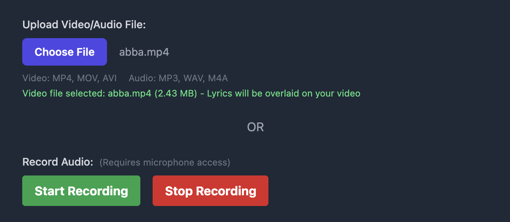
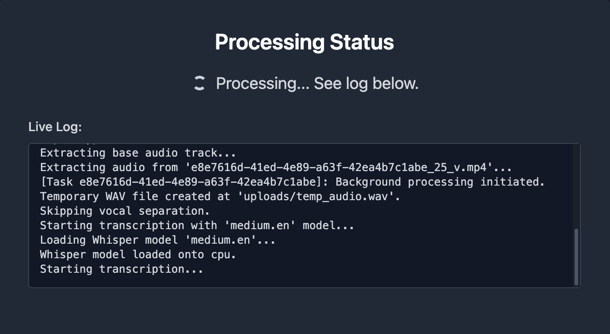
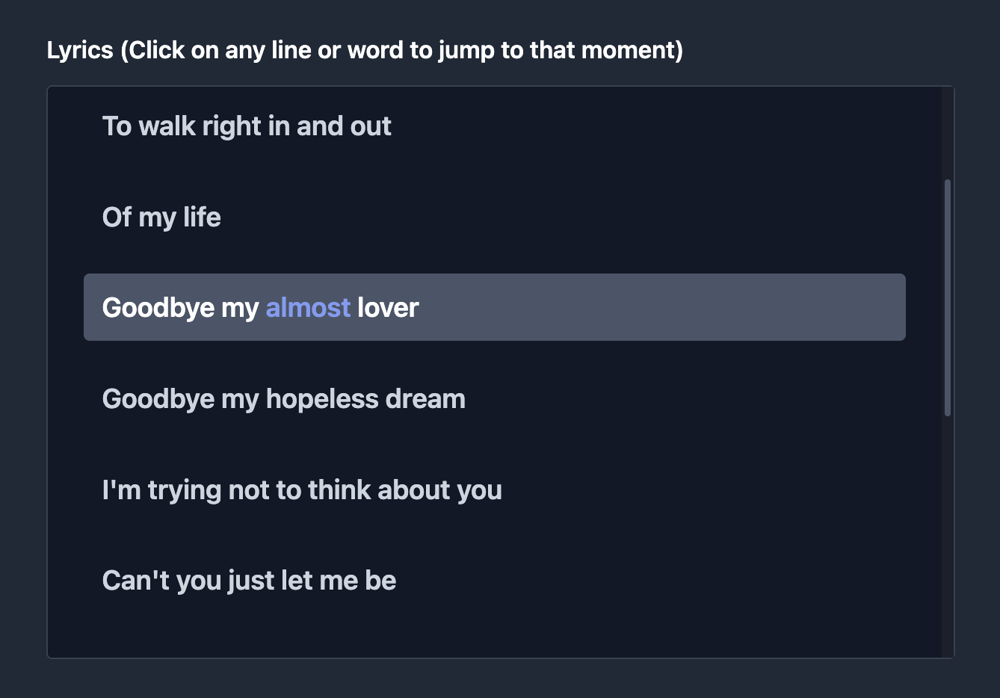
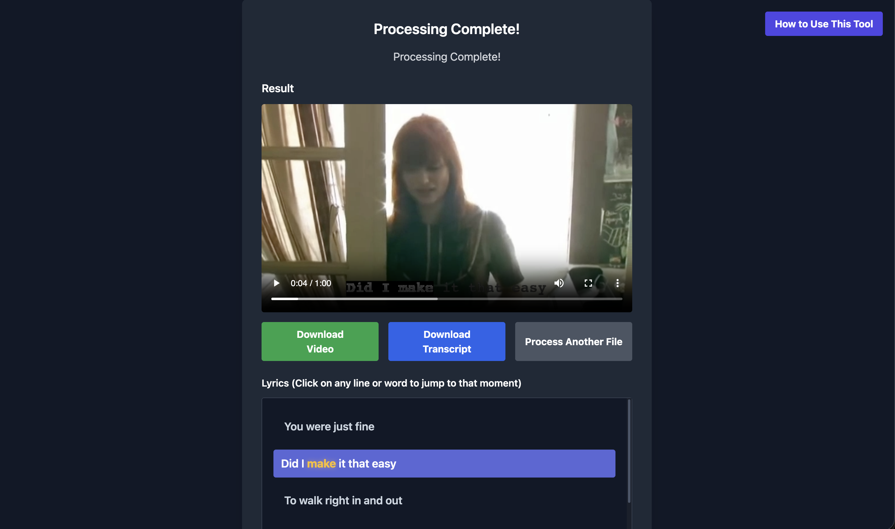

# 🎵 LyrAssist

**AI-Powered Lyric Transcription & Video Generation**

[](https://www.python.org/)
[](https://flask.palletsprojects.com/)
[](https://pytorch.org/)
[](https://github.com/openai/whisper)
[](LICENSE)

> A full-stack web application that automatically transcribes audio/video files and generates synchronized lyric videos using state-of-the-art AI models. Upload a song or video, and get back a professionally formatted lyric video with interactive transcript features.

[Demo Video](#) | [Report Issues](../../issues) | [Try it out yourself!](https://shyamksateesh.github.io/LyrAssist/)

---

## 📸 Project Showcase

<div align="center">

### Upload Interface

*Clean, intuitive upload experience with multiple input methods*

### Processing View

*Real-time logs and progress tracking throughout the AI pipeline*

### Interactive Lyrics

*Spotify-style clickable transcript with synchronized playback*

### Result View

*Professional lyric videos with customizable styling options*

</div>

---

## 🎯 Features

### 🎤 Smart Audio Processing
- **Multiple Input Methods**: Upload audio files (MP3, WAV, M4A), video files (MP4, MOV, AVI), or record directly in your browser
- **Vocal Separation**: Optional AI-powered vocal isolation using Demucs for improved transcription accuracy on music tracks
- **Flexible Model Selection**: Choose from 5 Whisper model sizes to balance speed and accuracy

### 🎬 Intelligent Video Generation
- **Audio-to-Video**: Automatically generates lyric videos with black backgrounds for audio-only files
- **Video Enhancement**: Overlays synchronized lyrics on existing video content
- **Two Rendering Modes**:
  - **Phrase Mode**: Clean, phrase-level subtitles with dynamic positioning
  - **Karaoke Mode**: Word-by-word highlighting with precise timestamps (experimental)

### 📝 Interactive Transcript Features
- **Clickable Lyrics**: Click any word or line in the transcript to jump directly to that moment in the video
- **Auto-Play**: Video automatically starts playing when you click on lyrics
- **Downloadable Transcript**: Export timestamped transcripts as formatted text files
- **Spotify-Style UI**: Clean, modern interface with hover effects and smooth interactions

### ⚡ Real-Time Processing
- **Live Logs**: Watch real-time processing updates as AI transcribes and renders your video
- **Background Processing**: Asynchronous task handling prevents browser timeouts
- **Progress Tracking**: Clear status updates throughout the entire pipeline

---

## 🛠️ Technology Stack

### Backend
- **Python 3.10+** - Core application runtime
- **Flask** - Web framework for API and routing
- **OpenAI Whisper** - State-of-the-art speech-to-text transcription
- **WhisperX** - Forced alignment for word-level timestamps
- **Demucs** - Neural source separation for vocal isolation
- **MoviePy** - Video composition and subtitle rendering
- **PyTorch** - Deep learning backend

### Frontend
- **HTML5 + Tailwind CSS** - Responsive, modern UI
- **Vanilla JavaScript** - Client-side interactivity
- **MediaRecorder API** - Browser-based audio recording

### Media Processing
- **FFmpeg** - Video/audio encoding and processing
- **Pydub** - Audio manipulation and format conversion
- **h264_videotoolbox** - Hardware-accelerated video encoding (macOS)

---

## 🚀 Quick Start

### Prerequisites

1. **Python 3.10 or higher**
2. **FFmpeg** - Required for media processing
   ```bash
   # macOS
   brew install ffmpeg

   # Ubuntu/Debian
   sudo apt update && sudo apt install ffmpeg

   # Windows
   # Download from https://ffmpeg.org/download.html
   ```

### Setup

1. **Clone the repository**
   ```bash
   git clone https://github.com/shyamksateesh/LyrAssist.git
   cd LyrAssist
   ```

2. **Create a virtual environment**
   ```bash
   python -m venv venv

   # Activate on macOS/Linux
   source venv/bin/activate

   # Activate on Windows
   venv\Scripts\activate
   ```

3. **Install Python dependencies**
   ```bash
   pip install flask pydub openai-whisper moviepy numpy demucs torch torchaudio "numpy<2" --force-reinstall
   pip install git+https://github.com/m-bain/whisperX.git --upgrade
   ```

   > **Note**: NumPy is downgraded to <2.0 due to compatibility requirements with WhisperX dependencies.

4. **Create required directories**
   ```bash
   mkdir uploads outputs
   ```

### Starting the Application

1. **Run the Flask server**
   ```bash
   python app.py
   ```

2. **Open your browser**

   Navigate to `http://127.0.0.1:5001` 🎉

---

## 📖 Usage Guide

### Using LyrAssist

#### Step 1: Upload or Record
- **Upload a file**: Select an audio or video file from your device
- **Record audio**: Click "Start Recording" to capture audio from your microphone
- Supported formats: MP4, MOV, AVI (video) | MP3, WAV, M4A (audio)

#### Step 2: Configure Processing Options
- **Whisper Model**: Choose model size
  - Tiny: Fastest, lowest accuracy
  - Base: Fast, moderate accuracy
  - Small: Balanced
  - **Medium**: Recommended (best balance)
  - Large: Slowest, highest accuracy

- **Separate Vocals** (Optional): Isolate voice from background music - improves accuracy for songs (adds 30-60 seconds)

- **Karaoke Mode** (Optional): Enable word-by-word highlighting with precise timestamps - experimental (significantly slower)

#### Step 3: Process
Click "Start Processing" and monitor real-time logs as the AI:
1. Extracts and processes audio
2. Transcribes speech using Whisper
3. (Optional) Performs forced alignment for word timestamps
4. Generates video with synchronized lyrics

#### Step 4: Enjoy Your Result
- Watch the video with synchronized lyrics
- Click any lyric line or word to jump to that moment
- Download the video (MP4)
- Download the transcript (TXT with timestamps)

---

## 🏗️ System Architecture

```
┌────────────────────────────────────────────────────────────┐
│                     PROCESSING PIPELINE                    │
├────────────────────────────────────────────────────────────┤
│                                                            │
│  Upload → Audio Extract → Transcribe → Align → Render     │
│                                                            │
│  [User    [FFmpeg]      [Whisper]   [WhisperX] [MoviePy]  │
│   Input]                                                   │
│                                                            │
│  Optional: Vocal Separation (Demucs) for music tracks     │
│                                                            │
└────────────────────────────────────────────────────────────┘
```

**Web Layer**: Flask API with background threading for async processing  
**AI Layer**: Whisper + WhisperX for transcription and alignment  
**Media Layer**: FFmpeg + MoviePy for video composition

---

## 📂 Project Structure

```
LyrAssist/
├── app.py                    # Flask server & API endpoints
├── pipeline.py               # Main processing orchestration
├── audio_processing.py       # Audio extraction & vocal separation
├── transcription.py          # Whisper & WhisperX integration
├── video_processing.py       # Video composition & rendering
├── config.py                 # Configuration constants
├── templates/
│   └── index.html           # Web UI
├── uploads/                 # User uploaded files (gitignored)
├── outputs/                 # Generated videos (gitignored)
├── images/                  # Project screenshots
└── README.md
```

---

## ⚙️ Configuration

Edit `config.py` to customize:

```python
# Model settings
WHISPER_MODEL = "medium.en"

# Video styling
FONT_NAME = "Arial-Bold"
FONT_SIZE = 60
FONT_COLOR = "white"
STROKE_COLOR = "black"
STROKE_WIDTH = 2

# Audio processing
REPLACE_AUDIO_WITH_VOCALS = False  # Use separated vocals in output
```

---

## 📊 Performance Notes

- **Processing Time**: Varies based on file length, model size, and enabled options
  - Typical 3-minute song: ~30-90 seconds (Medium model, no vocal separation)
  - With vocal separation: add 30-60 seconds
  - With karaoke mode: significantly longer (2-3x)

- **Hardware Acceleration**:
  - macOS: Uses h264_videotoolbox for faster encoding
  - Other platforms: Falls back to libx264

- **GPU Support**:
  - CUDA-enabled GPUs accelerate transcription significantly
  - CPU-only mode is supported but slower

---

## 🐛 Troubleshooting

### Common Issues

**"FFmpeg not found"**
- Solution: Install FFmpeg and ensure it's in your system PATH

**"No module named 'whisperx'"**
- Solution: Install WhisperX from the GitHub repository:
  ```bash
  pip install git+https://github.com/m-bain/whisperX.git --upgrade
  ```

**"NumPy version compatibility error"**
- Solution: Downgrade NumPy:
  ```bash
  pip install "numpy<2" --force-reinstall
  ```

**Video encoding fails**
- Try changing the codec in `video_processing.py`:
  ```python
  # Change from h264_videotoolbox to libx264
  codec='libx264'
  ```

---

## 🗺️ Roadmap

### Planned Features

- [ ] Real-time streaming transcription via WebSocket
- [ ] Multi-language support
- [ ] Cloud deployment with task queue (Celery + Redis)
- [ ] Advanced lip-reading (AV-ASR) for noisy videos
- [ ] Custom styling options for lyrics
- [ ] Batch processing for multiple files
- [ ] User accounts and file history

---

## 🤝 Contributing

Contributions are welcome! Here's how to get started:

1. Fork the repository
2. Create a feature branch (`git checkout -b feature/new-feature`)
3. Make your changes with clear commit messages
4. Test thoroughly (see [Testing](#testing) below)
5. Submit a Pull Request

### Development Guidelines

- Follow existing code style and conventions
- Add comments for complex logic
- Keep components focused and reusable
- Test on multiple browsers and platforms

### Testing Checklist

Before submitting a PR:

- [ ] Tested on Chrome, Firefox, and Safari
- [ ] Verified with both audio and video inputs
- [ ] Tested vocal separation feature
- [ ] Confirmed karaoke mode works
- [ ] No console errors or warnings

---

## 📄 License

This project is licensed under the **MIT License** - see [LICENSE](LICENSE) file for details.

**Third-Party Licenses**:
- OpenAI Whisper (MIT), WhisperX (BSD), Demucs (MIT)
- Flask (BSD-3-Clause), MoviePy (MIT)

---

## 🙏 Acknowledgments

### Core Technologies & Tools

- **[OpenAI Whisper](https://github.com/openai/whisper)** - State-of-the-art speech recognition
- **[WhisperX](https://github.com/m-bain/whisperX)** - Forced alignment for precise timestamps
- **[Demucs](https://github.com/facebookresearch/demucs)** - Music source separation
- **[Flask](https://flask.palletsprojects.com/)** - Lightweight web framework
- **[MoviePy](https://zulko.github.io/moviepy/)** - Video editing and composition

### Special Recognition

- **OpenAI** - For pioneering accessible AI transcription
- **The Open Source Community** - For making this project possible

---

## 📧 Contact

**Shyam Krishna Sateesh**
- Email: shyam.s@nyu.edu
- GitHub: [@shyamksateesh](https://github.com/shyamksateesh)
- LinkedIn: [linkedin.com/in/shyamksateesh](https://www.linkedin.com/in/shyamksateesh/)

**Project Repository**: [github.com/shyamksateesh/LyrAssist](https://github.com/shyamksateesh/LyrAssist)

---

<div align="center">

**Built with ❤️ for seamless lyric video generation**

If you find this project useful, please ⭐ **star the repo**!

[Report Bug](../../issues) · [Request Feature](../../issues)

</div>